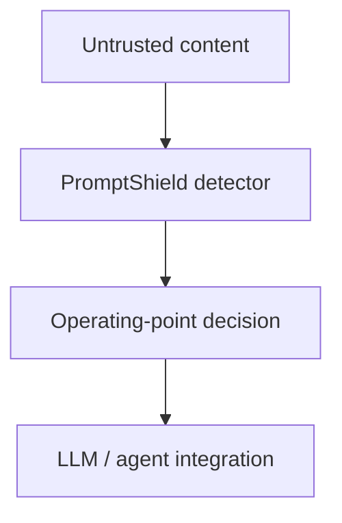

# PromptShield

## 1. Problem

PromptShield detects instructions embedded in untrusted text that attempt to redirect an
LLM or agent. It is a compact English/Russian ML engineering project: provenance-aware
data construction, three detector comparisons, calibration, diagnostic evaluation and
one CPU inference service. The target is `benign` versus `prompt_injection`.

## 2. Threat model

Inputs include direct user submissions and indirect retrieved documents, tool outputs,
email, webpages and code. Legitimate instructions, quoted attacks, security research and
source-code fixtures are important hard negatives. Jailbreak detection is a separate
scope; the PINT example includes a jailbreak row and is reported accordingly.

## 3. Architecture



The custom experiment supports a calibrated decision. The deployed service instead uses
**unmodified ProtectAI DeBERTa v2, uncalibrated, at threshold 0.5**. An API client decides
how to handle flagged content; the AgentDojo adapter withholds flagged tool outputs.
No general-purpose LLM agent is part of the service.

## 4. Dataset

`starter-v1`: 100 records, 57 benign / 43 injection, 68 English / 32 Russian,
32 hard negatives and 41 protected groups. Train/validation/test: **70 / 16 / 14**.
A reviewed allowlist contributes 36 rows from pinned `deepset/prompt-injections`;
the remaining 64 are AI-authored bilingual examples, including paired translations.
This is a convenience starter corpus, not a representative benchmark.

Raw bytes are immutable and checksum-verified. Canonical Parquet records preserve
source, language, role, mode, group and metadata. Translations, templates and known
families stay together across splits. The final audit found no exact/normalized
cross-split duplicates, lexical near warnings or internal/PINT-example overlap.
Lexical checks cannot prove semantic independence or external-model training independence.
See [data card](DATA_CARD.md), [sources](data/SOURCES.md) and [audit](AUDIT_REPORT.md).

## 5. Models

| Detector | Training and input policy |
|---|---|
| Character TF-IDF + logistic regression | Train-only 3–5 grams; validation-selected F1 threshold |
| ProtectAI DeBERTa-v3-base Prompt Injection v2 | Frozen external English-first model; 512-token windows, 64-token overlap, maximum score |
| Custom multilingual DistilBERT | Full fine-tuning; validation-selected checkpoint; first 256 tokens |

Exact model revisions and configuration are in the [reproduction guide](docs/REPRODUCTION.md)
and [model-selection ADR](docs/adr/model-selection.md). Russian DeBERTa evaluation measures
cross-lingual generalization. Its weights, calibration and threshold were not adapted.
Different training histories, input policies and operating objectives limit comparisons.

## 6. Internal evaluation

Historical frozen test: **n=14 (4 positive / 10 negative)**. AUPRC means average precision.
ROC summaries are descriptive ranking statistics, not test-selected serving thresholds.

| Detector | AUPRC | Recall @ 1% FPR | FPR @ 95% recall | F1 | Brier |
|---|---:|---:|---:|---:|---:|
| TF-IDF | 0.532576 | 0 | 0.7 | 0.666667 | 0.204418 |
| DeBERTa v2 | 1 | 1 | 0 | 0.888889 | 0.068647 |
| Custom, original operating point | 0.525 | 0 | 0.2 | 0 | 0.236534 |

English n=10 (2 positive/8 negative), Russian n=4 (2/2), hard negatives n=4 (all benign).
DeBERTa has one Russian hard-negative false positive; its perfect ranking does not mean
perfect decisions. Ten negatives cannot substantiate a true 1% FPR claim. Full subgroup
counts and errors: [baseline report](BASELINE_REPORT.md), [transformer report](TRANSFORMER_REPORT.md).

## 7. PINT evaluation

Only the **eight public examples (2 attack / 6 benign)** were available. This is inference
smoke scope, not full PINT or a leaderboard result. All categories remain, including one
jailbreak; an additional view excludes it. Language annotations are absent (EN/RU n=0).

| Detector | AUPRC | F1 | Brier |
|---|---:|---:|---:|
| TF-IDF | 1 | 1 | 0.188586 |
| DeBERTa v2 | 1 | 1 | 0.000162 |
| Custom, original operating point | 0.583333 | 0 | 0.237446 |

PINT never enters training, checkpoint selection, calibration or threshold selection.
Pinned source and category results: [baseline report](BASELINE_REPORT.md).

## 8. Calibration / operating point

TF-IDF threshold: 0.440305; DeBERTa: fixed 0.5. The original custom threshold 0.521561
maximizes validation recall subject to empirical FPR ≤1%; its test recall is zero.

A frozen follow-up fits custom-model temperature **T=0.183320** on validation only (n=16,
8/8), then selects minimum-FPR profiles at specified recall targets. Default threshold
0.399165 targets recall ≥0.80; high-security threshold 0.323077 targets ≥0.95.
On the already-observed test, default recall/FPR/F1 is **1 / 0.2 / 0.8**;
high-security is **1 / 0.8 / 0.5**. Test Brier improves 0.236534 → 0.197017,
but five-bin ECE worsens 0.197184 → 0.343071. Ranking is unchanged.

Validation was reused for checkpoint selection, fitting and profiles. These probabilities
and recall targets are provisional; this was not a fresh unseen test. The service does
not use these custom profiles. See [calibration report](CALIBRATION_REPORT.md).

## 9. Robustness

Five bounded edits cover typos, whitespace, Unicode confusables, code-block wrapping and
benign prefixes: 14 test parents, 70 generated rows, 66 valid and 4 ambiguous exclusions.
DeBERTa context expansion lowers AUPRC 1 → 0.916667 and raises frozen FPR 0.1 → 0.2.
Custom wrapping lowers AUPRC 1 → 0.875 on its eligible n=10 subset. Each comparison uses
matching clean parents. These are small, previously observed diagnostic samples, with
Russian n=4, not broad adversarial evidence. No tuning or augmentation followed.
See [robustness report](ROBUSTNESS_REPORT.md).

## 10. AgentDojo security / utility

AgentDojo 0.1.35 / benchmark v1.2.2: one official banking task/attack pair and a scripted
oracle, with only in-memory sandbox tools. **No actual LLM evaluation or paid calls.**

| Condition | Attack successes | Clean utility successes | Attacked utility successes |
|---|---:|---:|---:|
| No detector | 1/1 | 1/1 | 0/1 |
| DeBERTa v2 | 0/1 | 1/1 | 0/1 |
| Custom calibrated default | 0/1 | 0/1 | 0/1 |

These six episodes verify integration and official success predicates. They cannot
estimate real-agent security gains or utility costs. Tool-output screening cannot undo
an already executed tool side effect. See [AgentDojo report](AGENTDOJO_REPORT.md).

## 11. Serving

FastAPI loads one detector at startup and batches computation. Endpoints: `POST /v1/scan`,
`POST /v1/scan/batch`, `GET /health`, `GET /metrics`. Limits: 10,000 characters/input,
32 inputs/batch, `default` profile only. Raw text is omitted from telemetry.
Prometheus metrics cover requests, latency, errors, decisions, scores, lengths and model
identity; without labels they do not measure online precision or recall.

Real-model Uvicorn startup and all four endpoints passed locally. Historical warm
in-process HTTP p50/p95: 263.110/271.341 ms (20 sequential batch-1 requests, one CPU thread,
Ryzen 5 3500X, startup excluded). This is a sanity measurement, not a capacity claim.
Docker definition and lightweight CI exist; **Docker build/run and remote CI remain
unverified** on this workstation. See [serving report](SERVING_REPORT.md).

## 12. Limitations

The detector cannot guarantee prompt-injection prevention. Benchmarks do not guarantee
production security. Distribution shift, false positives and false negatives remain;
defense in depth remains necessary.

Additional limits: tiny convenience data; entirely authored Russian; no independent
annotation review; unresolved upstream dataset license conflict; possible external-model
training overlap; archived English-first external model; long-window false positives;
custom tail truncation; validation reuse and previously observed test; unavailable full
PINT; scripted-only AgentDojo; CPU-only validation. Serving is a serialized single process
with ephemeral metrics and no authentication, TLS or rate limiting. No production-readiness
claim is made. Model/result artifacts are local and Git ignored; compact reports retain
historical measurements. [Final audit](AUDIT_REPORT.md) records verification boundaries.

## 13. Reproduction

Use CPython 3.14.7 and uv 0.12.19 from the repository root:

```sh
uv python install
uv sync --locked --group agentdojo
uv run --locked --group agentdojo ruff check .
uv run --locked --group agentdojo ruff format --check .
uv run --locked --group agentdojo pyright
uv run --locked --group agentdojo pytest -q
```

Installation/checks need no model download, real training or AgentDojo experiment. The
optional AgentDojo group enables its integration tests; without it, omit that test module.
The test suite includes a tiny random toy training test, not real encoder training.
Fresh installation from the populated lock-compatible cache passed during Task 8.

The [reproduction guide](docs/REPRODUCTION.md) gives data acquisition/build, training,
frozen evaluation, calibration, optional diagnostics, API and Docker commands. Downloads,
real training and benchmark inference are manual. On this Windows workstation only,
`. ./scripts/activate-local.ps1` activates the repository-local toolchain/cache.
